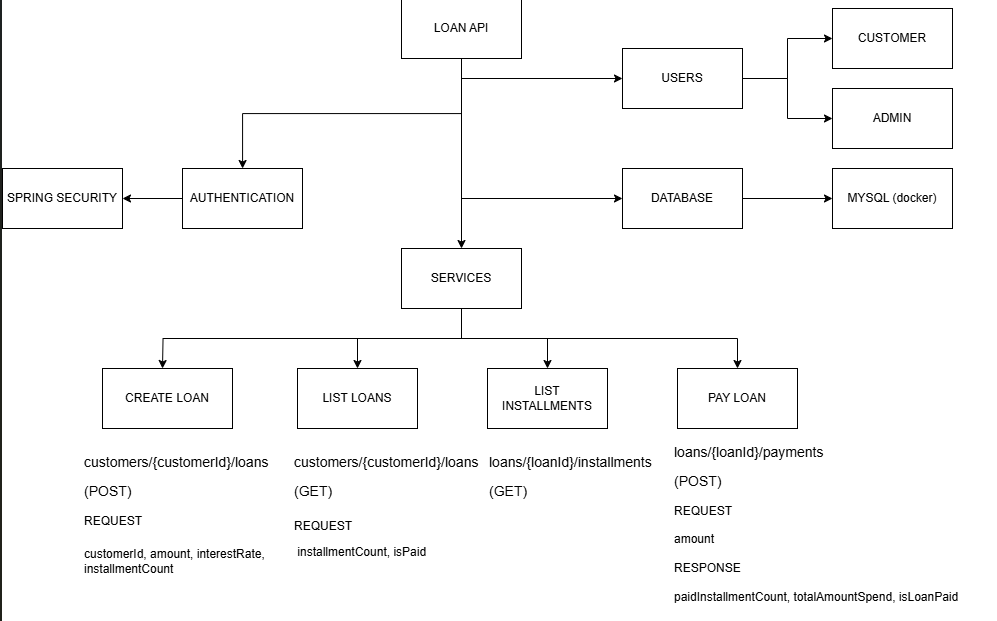

# Technologies and Architecture

This project is written using following technologies: Spring Boot, Hibernate, Spring Security and Docker used for 
local database

I used N-tier archictecture for project following controller-service-repository pattern.
Controller part was responsible for handling HTTP requests and sending back responses. Service part is where all the business logic took place,
in service I used domain objects which are completely seperate from other layers. Repository part is only responsible for database operations on domain objects.

All of the enpoints are secured using Basic Auth username and password authentication. Every user has role and every role has authorities. For example a user might have CUSTOMER role, and this ROLE has "create-loan" and "read-loan" authorities, in the code I ensured this authentication mechanism. 

I ensure core business logic of the application with unit testing

How to build and run the application?
--
1 -) You need to run your make sure your local Docker engine is running

2-) "docker compose up" will create and run mysql container in your Docker

3-) ./mvnw clean install will build the project and download required dependencies

4-) you can connect to database using this url: jdbc:mysql://localhost:3357/loanapi?useUnicode=true&useJDBCCompliantTimezoneShift=true&useLegacyDatetimeCode=false&serverTimezone=Europe/Istanbul    username is root password is beran123

5-) I deliberately made hibernate execute ddl false, and for tests purposes you have schema.sql and data.sql. When you up the application for the first time required test tables will be created and a customer and a admin user will be created. Keep in mind that these scripts are executed every time you up the application, so after one time you should make spring.sql.init.mode=always to never

How to send request to endpoints?
-
Every time you send a request you need to add Authorization header. In this header it should contain Base64 encoded version of your username and password in such format: username///password

here is an example Base64 encoded text with admin///12345  YWRtaW4vLy8xMjM0NQ==

I will send an example Postman collections by email
